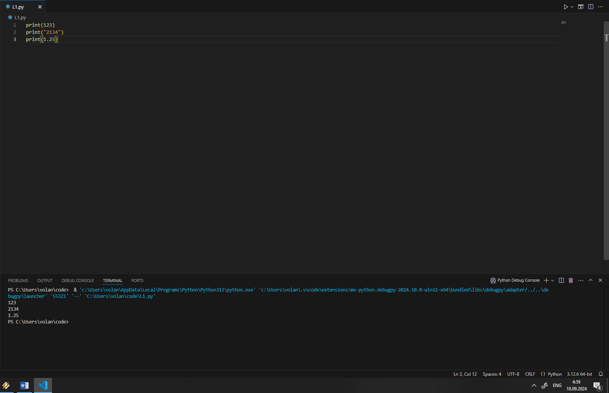

# Тема 6. Базовые коллекции: словари, кортежи
Отчет по Теме #6 выполнил:
- Сартаков Василий Александрович
- ИВТ-22-2

| Задание | Лаб_раб | Сам_раб |
| ------ | ------ | ------ |
| Задание 1 | + | + |
| Задание 2 | + | + |
| Задание 3 | + | + |
| Задание 4 | + | + |
| Задание 5 | + | + |

знак "+" - задание выполнено; знак "-" - задание не выполнено;

Работу проверили:
- к.э.н., доцент Панов М.А.

## Лабораторная работа №1
### В школе, где вы учились, узнали, что вы крутой программист и попросили написать программу для учителей, которая будет при вводе кабинета писать для него ключ доступа и статус, занят кабинет или нет. При написании программы необходимо использовать словарь (dict), который на вход получает номер кабинета, а выводит необходимую информацию. Если кабинета, который вы ввели нет в словаре, то в консоль в виде значения ключа нужно вывести “None” и виде статуса вывести “False”.

```python
request=int(input('Введите номер кабинета: '))

dictionary={
    101: {'key':1234,'access':True},
    102: {'key':1337,'access':True},
    103: {'key':2002,'access':True},
    104: {'key':3713,'access':False},
    None: {'key':None,'access':None},
}

response=dictionary.get(request)
if not response:
    response=dictionary[None]
key=response.get('key')
access=response.get('access')
print(key,access)
```

### Результат.

