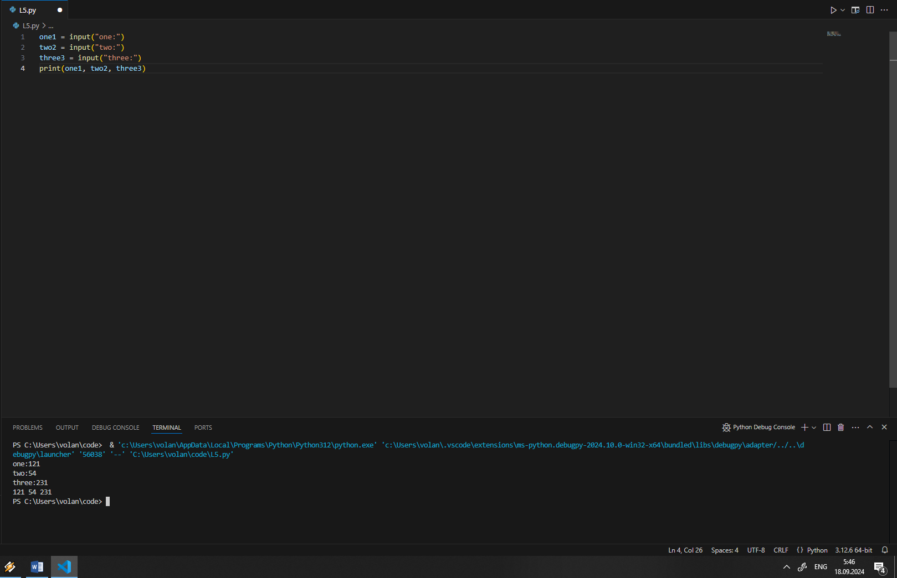
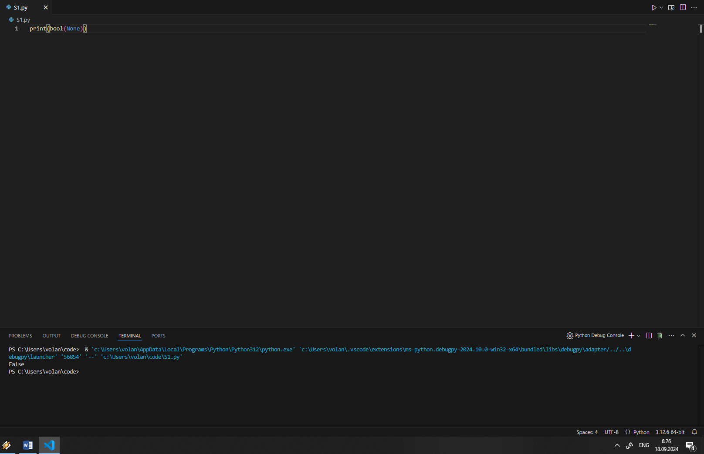
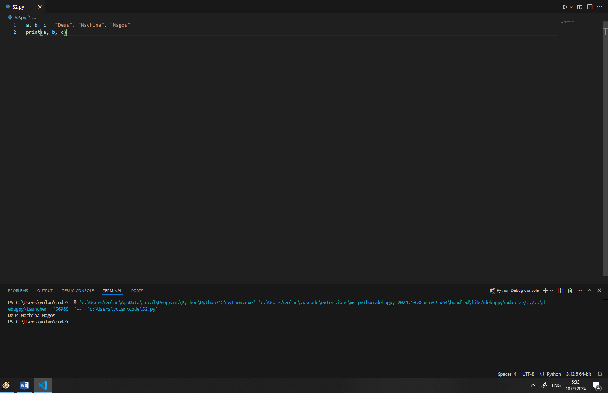
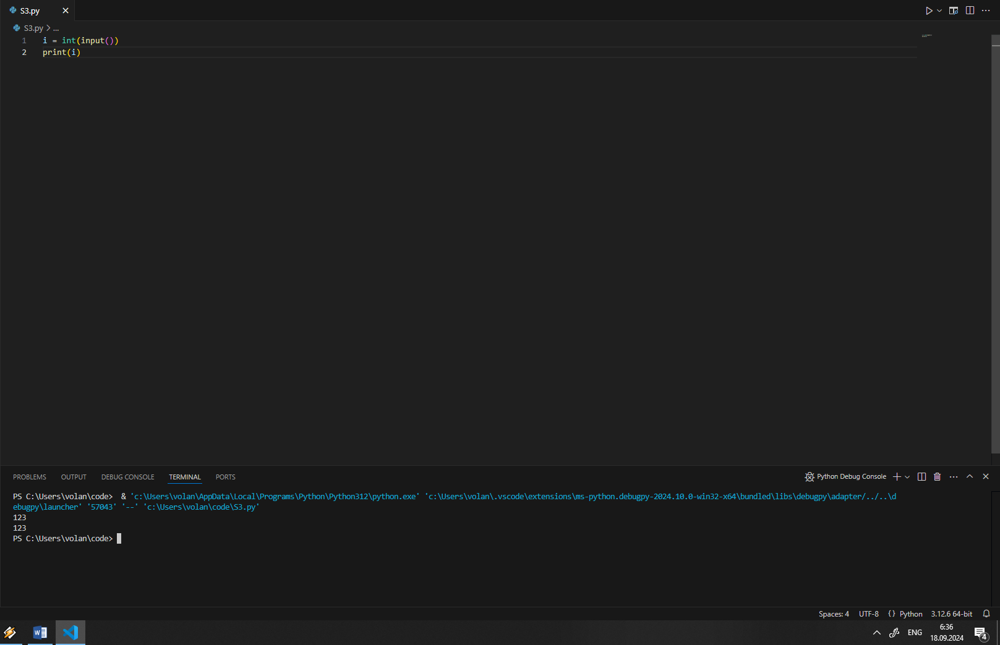
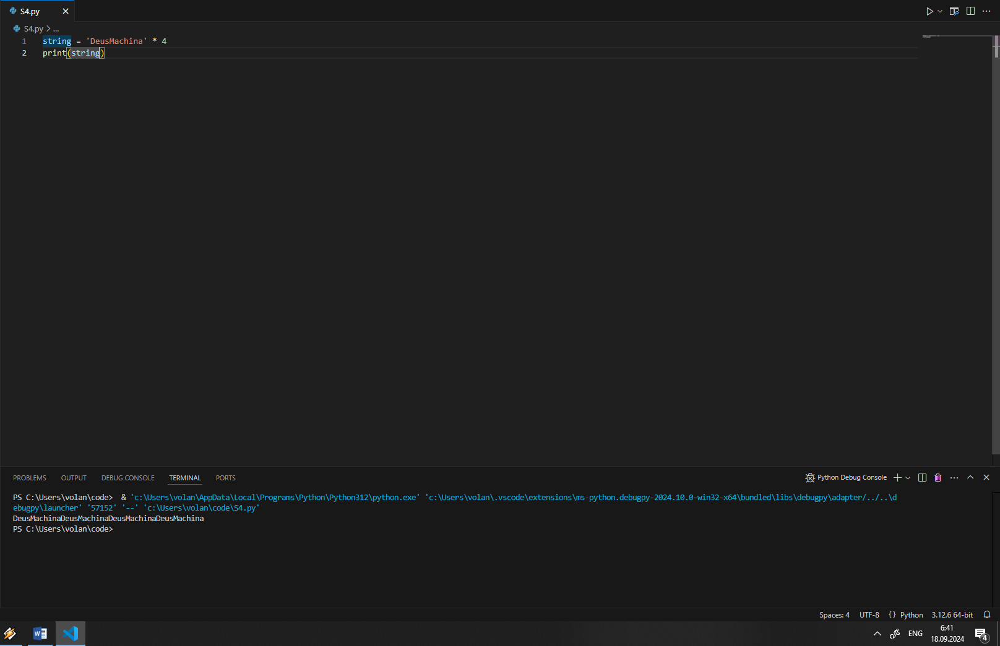
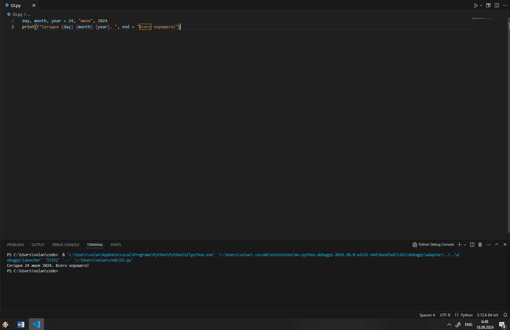

# Тема 8. Основы ООП 
Отчет по Теме #8 выполнил:
- Шашков Владимир Дмитриевич
- ИВТ-22-2

| Задание | Лаб_раб | Сам_раб |
| ------ | ------ | ------ |
| Задание 1 | + | - |
| Задание 2 | + | - |
| Задание 3 | + | - |
| Задание 4 | + | - |
| Задание 5 | + | - |

знак "+" - задание выполнено; знак "-" - задание не выполнено;

Работу проверили:
- к.э.н., доцент Панов М.А.

## Лабораторная работа №1
### Создайте класс “Car” с атрибутами производитель и модель. Создайте объект этого класса. Напишите комментарии для кода, объясняющие его работу. Результатом выполнения задания будет листинг кода с комментариями

```python
class car: #Создание класса
    def __init__(self, manufac, model): #Устанавливание значений атрибутов класса
        self.manufac=manufac #Создание ссылки на текущий экземпляр класса
        self.model=model 

my_car=car("Audi", "A6") #Создание экземпляра класса
```

### Результат.


## Лабораторная работа №2
### Дополните код из первого задания, добавив в него атрибуты и методы класса, заставьте машину “поехать”. Напишите комментарии для кода, объясняющие его работу. Результатом выполнения задания будет листинг кода с комментариями и получившийся вывод в консоль

```python
class car: #Создание класса
    def __init__(self, manufac, model): #Устанавливание значений атрибутов класса
        self.manufac=manufac #Создание ссылки на текущий экземпляр класса
        self.model=model 
    def drive(self): #Создание метода класса
        print(f"Driving {self.manufac} {self.model}")

my_car=car("Audi", "A6") #Создание экземпляра класса
my_car.drive() #Вызов метода класса
```

### Результат.


## Лабораторная работа №3
### Создайте новый класс “ElectricCar” с методом “charge” и атрибутом емкость батареи. Реализуйте его наследование от класса, созданного в первом задании. Заставьте машину поехать, а потом заряжаться

```python
class car: #Создание класса
    def __init__(self, manufac, model): #Устанавливание значений атрибутов класса
        self.manufac=manufac #Создание ссылки на текущий экземпляр класса
        self.model=model 
    def drive(self): #Создание метода класса
        print(f"Driving {self.manufac} {self.model}")

my_car=car("Audi", "A6") #Создание экземпляра класса
my_car.drive() #Вызов метода класса

class electricCar(car): #Создание класса-наследника
    def __init__(self, manufac, model, capacity): #Устанавливание значений атрибутов класса-наследника
        super().__init__(manufac, model) #Вызов метода инициализации родительского суперкласса
        self.capacity=capacity
    
    def charge(self): #Создание метода класса-наследника
        print(f"Charging {self.manufac} {self.model} with {self.capacity} kWh charger")

my_el_car=electricCar('Tesla', 'Model X', 100) #Создание экземпляра класса-наследника
my_el_car.drive()
my_el_car.charge()
```

### Результат.


## Лабораторная работа №4
### Реализуйте инкапсуляцию для класса, созданного в первом задании. Создайте защищенный атрибут производителя и приватный атрибут модели. Вызовите защищенный атрибут и заставьте машину поехать. Напишите комментарии для кода, объясняющие его работу. Результатом выполнения задания будет листинг кода с комментариями и получившийся вывод в консоль

```python 
class car: #Создание класса
    def __init__(self, manufac, model): #Устанавливание значений атрибутов класса
        self._manufac=manufac #protected атрибут
        self.__model=model #private атрибут

    def drive(self): #Создание метода класса
        print(f"Driving {self._manufac} {self.__model}")

my_car=car("Audi", "A6") #Создание экземпляра класса
print(my_car._manufac)
my_car.drive() #Вызов метода класса
```

### Результат.


## Лабораторная работа №5
### Реализуйте полиморфизм создав основной (общий) класс “Shape”, а также еще два класса “Rectangle” и “Circle”. Внутри последних двух классов реализуйте методы для подсчета площади фигуры. После этого создайте массив с фигурами, поместите туда круг и прямоугольник, затем при помощи цикла выведите их площади. Напишите комментарии для кода, объясняющие его работу. Результатом выполнения задания будет листинг кода с комментариями и получившийся вывод в консоль

```python
class Shape: #Основной класс
    def Area(self):
        pass

class Rectangle(Shape): #Класс-наследник
    def __init__ (self, w, h):
        self.w=w
        self.h=h
    
    def Area(self): #Унаследованый метод
        return self.w*self.h

class Circle(Shape): #Класс-наследник
    def __init__ (self, r):
        self.r=r
    
    def Area(self): #Унаследованый метод
        return 3.14*self.r*self.r
```

### Результат.


## Самостоятельная работа №1
### Самостоятельно создайте класс и его объект. Они должны отличаться, от тех, что указаны в теоретическом материале (методичке) и лабораторных заданиях. Результатом выполнения задания будет листинг кода и получившийся вывод консоли

```python
class Team:
    def __init__(self, mate1, mate2):
        self.mate1=mate1
        self.mate2=mate2

rb_team=Team('Verstappen', 'Perez')
```

### Результат.


## Выводы
1. В Python класс можно создать командой ```class```

## Самостоятельная работа №2
### Самостоятельно создайте атрибуты и методы для ранее созданного класса. Они должны отличаться, от тех, что указаны в теоретическом материале (методичке) и лабораторных заданиях. Результатом выполнения задания будет листинг кода и получившийся вывод консоли

```python
class Team:
    def __init__(self, mate1, mate2):
        self.mate1=mate1
        self.mate2=mate2
    
    def members(self):
        print (f"Red Bull members is {self.mate1} and {self.mate2}")

rb_team=Team('Verstappen', 'Perez')
rb_team.members()
```

### Результат.


## Выводы
1. Чтобы создать атрибут класса в Python, его нужно определить вне метода ```init```.

## Самостоятельная работа №3
### Самостоятельно реализуйте наследование, продолжая работать с ранее созданным классом. Оно должно отличаться, от того, что указано в теоретическом материале (методичке) и лабораторных заданиях. Результатом выполнения задания будет листинг кода и получившийся вывод консоли

```python
class Team:
    def __init__(self, mate1, mate2):
        self.mate1=mate1
        self.mate2=mate2
    
    def members(self):
        print (f"Red Bull members is {self.mate1} and {self.mate2}")

rb_team=Team('Verstappen', 'Perez')
rb_team.members()

class Leader(Team):
    def __init__(self, mate1, mate2):
        super().__init__(mate1, mate2)
    def leader(self):
        print(f'McLaren team leader is {self.mate1}')

team_lead=Leader('Norris', 'Piastri')
team_lead.leader()
```

### Результат.


## Выводы
1. Чтобы реализовать наследование необходимо создать класс и указать в скобках класс-родитель

## Самостоятельная работа №4
### Самостоятельно реализуйте инкапсуляцию, продолжая работать с ранее созданным классом. Она должна отличаться, от того, что указана в теоретическом материале (методичке) и лабораторных заданиях. Результатом выполнения задания будет листинг кода и получившийся вывод консоли

```python
class Team:
    def __init__(self, mate1, mate2):
        self.__mate1=mate1
        self.__mate2=mate2
    
    def members(self):
        print (f"Red Bull members is {self.__mate1} and {self.__mate2}")

rb_team=Team('Verstappen', 'Perez')
rb_team.members()
```

### Результат.


## Выводы
1. В Python модификаторы определяются при помощи ```_```

## Самостоятельная работа №5
### Самостоятельно реализуйте полиморфизм. Он должен отличаться, от того, что указан в теоретическом материале (методичке) и лабораторных заданиях. Результатом выполнения задания будет листинг кода и получившийся вывод консоли

```python
class points:
    def calculation(self):
        pass

class rally(points):
    def calculation(self):
        print('1 - 30 points, 2 - 27 points, 3 - 25 points')

class F1(points):
    def calculation(self):
        print('1 - 25 points, 2 - 18 points, 3 - 15 points')

r=input()
if r==1:
    p_r=rally
    p_r.calculation()
elif r==2:
    p_f=F1
    p_f.calculation()
```

### Результат.


## Выводы
1. Полиморфизм в Python — это способность выполнять одно и то же действие над объектами разных типов
